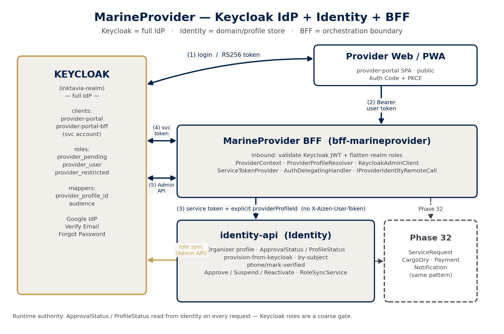
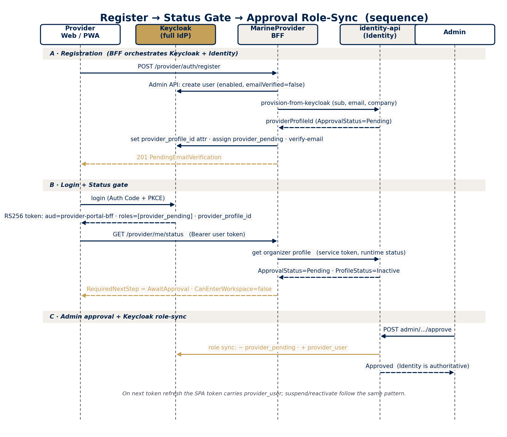

# MarineProvider — Architecture Overview (Keycloak IdP + Identity + BFF)

> Consolidated as of Phase 31C. Describes how the MarineProvider BFF, Keycloak, and the Identity module
> interact, and how the auth/scope structure is laid out for future operational modules (Phase 32+).
> Companion docs: `identity-provider-link-extension-phase31b-report.md`,
> `provider-keycloak-role-sync-phase31b.md`, `provider-identity-suspend-reactivate-phase31c.md`,
> `keycloak-provider-realm-configuration.md`, `keycloak-provider-realm-setup-phase31c.md`.

## 1. Core principle — three clean responsibilities

| Component | Responsibility |
|---|---|
| **Keycloak** (`inktavia-realm`) | **Full Identity Provider.** Password, Google/Apple social, email verification, forgot-password, sessions/revocation, roles. Issues RS256 tokens. |
| **Identity module** (`identity-api`) | **Domain / profile store.** Organizer profile, approval/profile status, documents, phone verification, business rules, lifecycle commands. No longer the human auth source for Provider Web. |
| **MarineProvider BFF** (`bff-marineprovider`) | **Provider-facing boundary + orchestration.** Validates Keycloak tokens, resolves provider identity, calls modules with a service token, strips admin-only fields. Never calls AdminPanel BFF. |

Not used / explicitly excluded: Keycloak User Storage SPI, Keycloak federation, `IOAuthProviderClient` (legacy
custom OAuth), Keycloak SMS-OTP login, fabricated `X-Aizen-User-Token`, legacy Identity HS256 self-token as
Provider Web auth.

## 2. Component diagram (text)

```
     Provider Web/PWA  (provider-portal SPA — public client, Auth Code + PKCE)
                 │ (1) login          ▲ RS256 access token
                 ▼                    │  aud=provider-portal-bff · realm_access.roles · provider_profile_id
   ┌───────────────────────────────────────────────────────────┐
   │                KEYCLOAK  (inktavia-realm)  = full IdP        │
   │  clients: provider-portal (public), provider-portal-bff (conf.+svc acct)
   │  roles:   provider_pending / provider_user / provider_restricted
   │  mappers: provider_profile_id (user attr → claim), audience → provider-portal-bff
   │  Google IdP · Verify Email · Forgot Password
   └──────▲──────────────────▲───────────────────────┬──────────┘
 (2) user  │        (4) client_credentials            │ (5) Admin API
   token   │            service token                 │ create user / set attr /
          │                                           │ assign-remove role / logout
   ┌───────┴──────────────────┴───────────────────────▼──────────┐
   │            MarineProvider BFF  (bff-marineprovider)           │
   │  inbound: validate Keycloak JWT (issuer/aud/JWKS) + flatten   │
   │           realm_access.roles → ClaimTypes.Role                │
   │  ProviderContext · ProviderProfileResolver                    │
   │  ProviderKeycloakAdminClient · ProviderKeycloakServiceToken   │
   │  MarineProviderBffAuthDelegatingHandler (injects svc token)   │
   │  IProviderIdentityRemoteCall (Refit)                          │
   └───────────────────────────┬───────────────────────────────────┘
        (3) Authorization: Bearer <SERVICE TOKEN>
            + explicit params (keycloakSubject, providerProfileId)
            (NO X-Aizen-User-Token)
                                ▼
   ┌───────────────────────────────────────────────────────────┐
   │            identity-api  (Identity module) = domain store   │
   │  Organizer profile · ApprovalStatus · ProfileStatus         │
   │  provision-from-keycloak · get-by-subject · phone/mark-verified
   │  Approve / Suspend / Reactivate (admin)                     │
   │  IProviderKeycloakRoleSyncService ─────────────────────────┼─► (5) Keycloak Admin API
   │  UserEntity.KeycloakSubjectId  ↔  providerProfileId         │
   └───────────────────────────────────────────────────────────┘

   Phase 32 (not yet):  BFF ──service token──► ServiceRequest / CargoDry / Payment / Notification / Performance
```

## 3. Two-directional token strategy (the heart of it)

**Inbound (SPA → BFF).** The SPA obtains an RS256 access token from Keycloak (Auth Code + PKCE). The token
carries `aud=provider-portal-bff`, `realm_access.roles`, and (after provisioning) the `provider_profile_id`
claim. The BFF receives it in the standard `Authorization: Bearer` header, validates issuer/audience against
the realm JWKS, and flattens Keycloak's nested `realm_access.roles` into `ClaimTypes.Role` so ASP.NET policies
can read `provider_pending` / `provider_user` / `provider_restricted`.

**Outbound (BFF → module).** The BFF acquires a **service token** via `client_credentials` on the
`provider-portal-bff` service account and calls downstream modules with `Authorization: Bearer <service token>`.
It **does not** forward or fabricate an Identity `X-Aizen-User-Token`. The provider's identity is passed to
modules **explicitly** as endpoint parameters (`keycloakSubject`, `providerProfileId`). Modules read the
service token's `sub` for authorization; the user-token header is optional and degrades gracefully.

**providerProfileId resolution (`ProviderProfileResolver`).** Order: (1) `provider_profile_id` token claim →
(2) Keycloak `sub` → (3) Identity by-subject lookup. **Never trusted from browser/body.**

**Runtime authority.** Approval/suspension is read from **Identity on every request** (BFF `ProviderActive` /
`ProviderPendingOrActive` policies + resolver), not from token roles. So a suspend takes effect immediately even
while a Keycloak token is still valid — Keycloak roles are a coarse gate; **Identity status is authoritative**.

## 4. Key flows

### 4.1 Register (email/password)
BFF `POST /api/v1/provider/auth/register` → create Keycloak user (Admin API) → Identity
`provision-from-keycloak` (creates Organizer profile, `ApprovalStatus=Pending`) → write `provider_profile_id`
attribute on the Keycloak user → assign `provider_pending` role → trigger Verify Email. Idempotent.

### 4.2 Ensure-profile (Google / social)
Keycloak handles the Google login (native identity provider). Then BFF
`POST /api/v1/provider/auth/ensure-profile` → by-subject lookup → provision if missing → write attribute +
ensure `provider_pending`. No OAuth exchange in the BFF.

### 4.3 Status gate
`GET /api/v1/provider/me/status` → resolve `providerProfileId` → read runtime Identity status → return a single
`RequiredNextStep` (`VerifyEmail` / `AwaitApproval` / `EnterWorkspace` / `Suspended` / `Rejected`) plus
`CanEnterWorkspace`.

### 4.4 Phone OTP (optional verification)
BFF `send-otp` / `verify-otp` → existing Identity OTP; on success, Identity persists `PhoneVerified` /
`PhoneVerifiedAt`. Not a login method; no Keycloak SMS-OTP.

### 4.5 Lifecycle + role sync (admin, on identity-api)
Admin calls `approve` / `suspend` / `reactivate`. Identity changes status, then
`IProviderKeycloakRoleSyncService` syncs Keycloak roles:

| Transition | Keycloak roles |
|---|---|
| Approve | − provider_pending, + provider_user, − provider_restricted |
| Suspend | − provider_user, + provider_restricted, (optional) revoke sessions |
| Reactivate | + provider_user, − provider_restricted |

Role sync is **best-effort**: failures are logged and never roll back the Identity status change.

## 5. How the structure is laid out (code + infra)

**MarineProvider BFF** — folder-per-feature CQRS:
```
Application/
  Auth/RegisterProvider|EnsureProviderProfile/{Command, CommandHandler, [Validator]}
  Me/GetProviderMe|GetProviderProfile|GetProviderStatus/{Query, QueryHandler}
  Phone/SendProviderPhoneOtp|VerifyProviderPhoneOtp/{Command, CommandHandler, Validator}
  Contracts/{Auth,Me,Phone}/*Response, ProviderProfileDto
  Common/Options/MarineProviderKeycloakOptions
  Common/Services/{ProviderKeycloakServiceTokenProvider, ProviderKeycloakAdminClient, ProviderContext, ProviderProfileResolver}
  Common/Http/MarineProviderBffAuthDelegatingHandler
  Common/Authorization/ProviderAuthorization (policies + runtime-status handler)
  Common/RemoteClients/IProviderIdentityRemoteCall (Refit)
  DependencyInjection.cs
Controllers/V1/{ProviderAuthController, ProviderMeController}  (thin)
Extensions/AuthenticationExtensions.cs (inbound Keycloak JWT)  · Program.cs (slim)
```

**Identity module** — new provider-link surface, folder-per-feature, UoW + repository (no direct DbContext in
the new command handlers):
```
Domain/Entities/User/UserEntity.CreateFromKeycloak(...)  (+ LoginType.Keycloak)
Domain/Entities/UserProfile/UserProfileEntity.{Suspend, Reactivate, MarkPhoneVerified}
Domain/Interface/Service/{IOrganizerKeycloakProvisioningDomainService, IProviderKeycloakRoleSyncService}
Repository/Service/{OrganizerKeycloakProvisioningDomainService, ProviderKeycloakRoleSyncService}
Repository/Repository/UserProfileRepository.GetOrganizerProfileByKeycloakSubjectAsync
Application/Organizer/Command/{ProvisionOrganizerFromKeycloak, MarkOrganizerPhoneVerified, SuspendOrganizerProfile, ReactivateOrganizerProfile}
Application/Organizer/Query/GetOrganizerProfileByKeycloakSubject  (no CQRS-in-CQRS; inline mapping)
Controller/V1/Identity/{ProviderLinkController (provision/by-subject/phone), AdminController (+suspend/+reactivate)}
Abstraction/Options/IdentityKeycloakOptions
```

**Infrastructure**
- `docker-compose.yaml`: `bff-marineprovider` service (mirrors `bff-adminpanel`) — `Dockerfile.MarineProvider`,
  port `17002`, `MarineProviderKeycloak__*` + `RemoteCalls__IProviderIdentityRemoteCall__BaseUrl` env.
- Role sync runs inside `identity-api` → its `IdentityKeycloak__*` env belongs to the **identity-api** service.
- Keycloak realm artifacts: `infrastructure/keycloak/provider-realm/` (setup script + partial import + docs).

## 6. Interaction with other modules

Today the BFF talks **only to Identity** (identity/profile/lifecycle). ServiceRequest, CargoDry, Payment,
Notification, and Performance are **Phase 32**, but the pattern is already fixed: the BFF calls each module's
provider-safe endpoints with the service token, passes `providerProfileId` explicitly, enforces provider-owned
scope, and strips admin-only fields. The auth/scope skeleton built in 31A–31C is the foundation those
operational read endpoints will sit on.

## 7. Security boundaries

- BFF is orchestration-only; it never calls AdminPanel BFF and never exposes admin-only data (internal note,
  reviewer, rejection category, risk internals, decision logs, cross-provider data).
- `provider-portal-bff` service account holds only what it needs: identity-api `identity_read` / `identity_write`
  + realm-management `view-users` / `query-users` / `manage-users`.
- `providerProfileId` is never trusted from the browser/body — always resolved server-side from the verified
  token or an Identity lookup.
- Runtime Identity `ApprovalStatus`/`ProfileStatus` is the authoritative access gate; Keycloak roles are a coarse
  helper that may lag a token refresh.

## 8. Configuration reference

| Section | Where | Purpose |
|---|---|---|
| `MarineProviderKeycloak` | BFF | inbound JWT (Authority/Audience/Metadata) + Admin API/service-token creds + role/attribute names |
| `RemoteCalls:IProviderIdentityRemoteCall:BaseUrl` | BFF | identity-api base URL |
| `IdentityKeycloak` | identity-api | role-sync Admin API creds + role names + `RevokeSessionsOnSuspend` |
| Keycloak realm | Keycloak | clients, roles, `provider_profile_id` + audience mappers, Google IdP, verify-email/forgot-password |

Shared secret: `KEYCLOAK_PROVIDER_BFF_CLIENT_SECRET` feeds the Keycloak client, the BFF
`MarineProviderKeycloak:AdminClientSecret`, and identity-api `IdentityKeycloak:AdminClientSecret`. Never committed.

## 9. Status & next

Phase 31A–31C are code-complete (auth foundation, provider-link, role sync, suspend/reactivate, compose,
realm artifacts). Closure requires the local build + Keycloak setup run + H1–H7 runtime smoke (see
`prompts/phase31c-*`). Phase 32 (operational read endpoints) starts once 31C smoke is green.

## 10. Diagrams (PNG)

**Architecture** — components + token directions (`diagrams/marine-provider-architecture.png`):



**Sequence** — Register → Status gate → Approval role-sync (`diagrams/marine-provider-sequence.png`):



> Source PNGs are regenerated with matplotlib; the numbered arrows (1)–(5) in the architecture diagram map to
> the token flows described in §3, and the sequence covers §4.1 (register), §4.3 (status gate) and §4.5
> (approval role-sync). Suspend/reactivate follow the same admin → Identity → role-sync pattern.
